# 个人介绍

## 张长志

专职大数据架构师

擅长android，Linux三剑客，Shell高级编程，自动化运维之kickstart/cobbler/rpm定制/yum仓库搭建/zabbix监控，大数据整套架构（hadoop,spark,hive,flink），给中国联通和其他大型公司多次企业内训，目前主要从事大数据和go语言开发和分享，服务过广告、电商、电信行业

# Docker简介

## 自动化部署

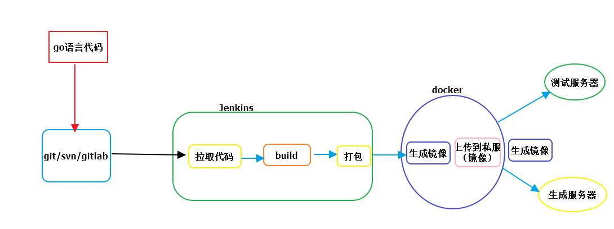

1.编写代码，修改代码

2.提交代码到git/svn/gitlab

3.jenkins自动检测到git/gitlab/svn代码更新，从git/gitlab/svn拉取最新代码

4.jenkins自动编译

5.jenkins自动打成能运行的war/jar包或者其他语言可以运行的对应的包

6.jenkins自动上传可以运行的包到docker宿主机目录

7.jenkins自动构建web容器镜像，包含项目代码demo

8.jenkins自动启动镜像，编程容器，映射端口

9.最后就有项目运行界面

10.测试人员可以安装这种运行在测试服务器进行测试

12.运维人员就可以用同样的部署运行在生成服务器上面


# docker 的广泛使用和docker的好处

1）区分开发 测试 运维的分工，出现问题不会互相推卸责任

2）可以合理利用服务器资源，不会像vmware的使用那么庞大

3）可以快速使用docker实现mysql redis nginx 的机器和负载均衡

4）方便实现自动化部署

5）k8s

# docker目标

+ 掌握Docker基础知识，能够理解docker镜像和容器的概念

+ 完成docker安装和启动

+ 掌握docker镜像与容器相关的命令

+ 掌握Tomcat mysql nginx等软件的部署

+ 掌握docker迁移和备份相关的命令

+ 能够运行dockefile编写创建容器的脚本

+ 能够搭建与使用dock所有仓库

  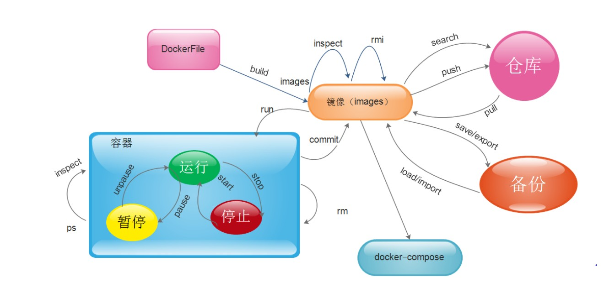


# 虚拟化

在计算机中，虚拟化是一种资源管理技术，是讲计算机各种实体资源，比如服务器，网络，内存以及存储等，给与抽象，转换后呈现出来，打破实体机构间的不可分割的障碍，使用户可以比原来更好的利用这些资源，这些资源的新虚拟部分是不受现有的资源的架设方式，地域或者物理状态的限制，一般所指的虚拟化资源包括计算能力和存储能力。

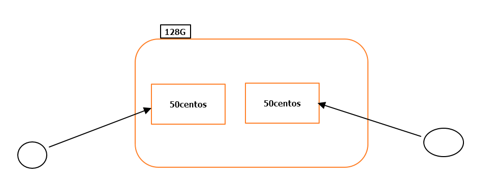

在实际生产中，虚拟技术主要解决高性能的物理硬件过剩和老的旧的设备硬件能力过低的重新组装使用，透明化底层物理硬件，从而最大化的利用物理硬件对资源充分利用

虚拟化技术包括：软件虚拟化，内存虚拟化 硬件虚拟化 网络虚拟化 桌面虚拟化 服务虚拟化 虚拟化等


# 什么是docker

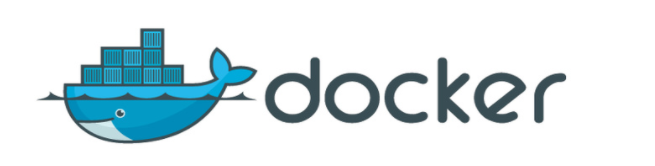

docker是一个开源的项目，是在2013年，最初由dotcloud公司内部的一个业余的项目发展起来的，它基于google公司推出go语言实现的，docker项目加入linux基金会，遵循了apche2.0协议，项目公布在github上面。

docker项目目标是实现**轻量级的操作系统虚拟化**解决方案，docker的基础是linux容器（LXC）技术

在LXC基础上docker进行了进一步开发，让用户不需要关心容器的管理，使用户操作简单，用户操作docker就像操作一个快速轻量级的**虚拟机一样简单**。

为何选择docker

（1）上手快

   用户只需要几分钟，就可以把自己的程序“docker化”，随后，就可以创建容器来运行程序。大多数docker容器只需要1秒就可以启动。由于去除了管理程序开销，docker容器拥有很高的性能，同时一台宿主机可以运行多个容器，使用户可能的利用系统资源

（2）职责划分明确

 使用docker，开发人员只需要关心容器中运行的程序，而运维人员只需要关心如何管理容器。docker设计目的就是要加强开发人员写代码的开发环境与应用部署的环境要一致。从而降低那种“开发时一切正常，肯定是运维的问题（测试是正常的，上线后出现了就归结于运维问题）”

（3）快速高效的生命周期

docker的目标之一，就是缩短代码开发测试部署，上线运行的周期，让你的程序具备可移植性，易于构建，并易于协作（通俗讲，docker就像一个盒子，里面可以装很多物件，如果需要这些物件可以直接从盒子里拿走，而不要从该盒子一件件去取）

（4）鼓励使用面向服务架构

docker鼓励使用微服务，docker推荐单个容器只运行一个应用程序或者进程。这就形成了一个分布式的应用程序模型。在这种模型下，应用程序和服务可以表示为一系列的互联容器（可以在一个容器里运行多个程序）


# 容器和虚拟化比较

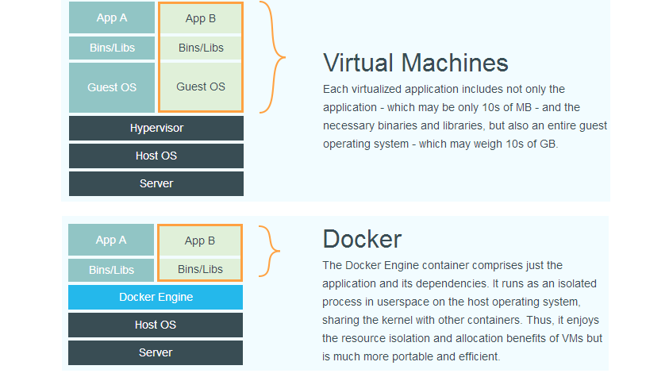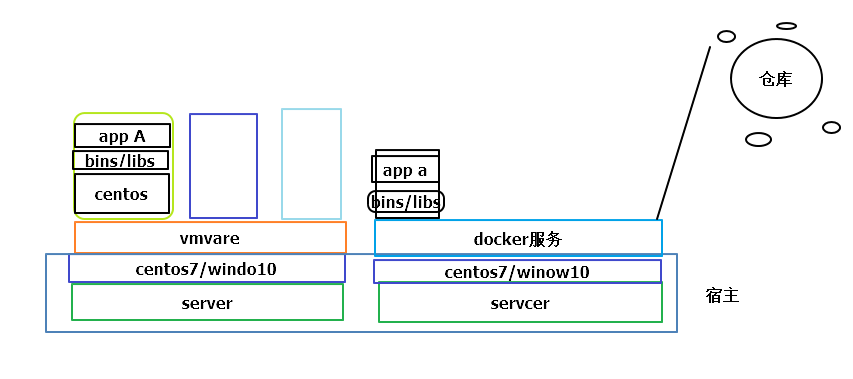

上图比较了docker和传统的虚拟机不同之处，可以见容器在操作系统层次上虚拟化，直接复用本地的操作系统，而传统的方式则在硬件上实现。与传统的相比，docker优势在于启动快，体积小。


# Docker 组件

## docker服务器与客户端

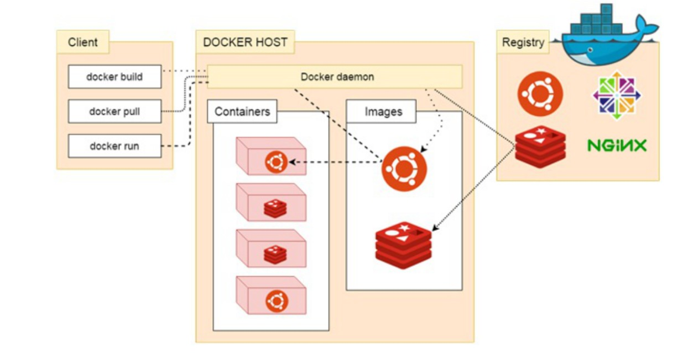

 Docker是一个客户端-服务器（c/s）架构程序，docker客户端只需要向docker服务器或者守护进程发出请求，服务器或者守护进程将完成所有的工作并返回结果。Docker提供了一个命令行工具Docker以及一套RESTful api操作。你可以在同一台宿主机上运行docker守护进程和客户端。也可以从本地docker客户端连接到运行另一台宿主机的远程docker守护进程


# docker镜像与容器

容器与镜像的关系类似于面向对象中的对象与类。

| Docker | 面向对象 |
| ------ | -------- |
| 镜像   | 类       |
| 容器   | 对象     |

# docker组件说明 

| 标题              | 说明                                                         |
| ----------------- | ------------------------------------------------------------ |
| 镜像（Images）    | Docker镜像用于创建Docker容器的模板                           |
| 容器（Container） | 容器是独立运行的一个或者一组应用                             |
| 客户端（clinet）  | Docker客户端通过命令行或者其他工具使用dockerapi与docker的守护进程通信 |
| 主机（Host）      | 一个物理或者虚拟机用于执行docker守护进程和容器               |
| 仓库（Registry）  | Docker仓库用来保存镜像，可以理解为代码控制中代码仓库。Docker Hub（https://hub.docker.com/）提供了庞大的镜像集合供我们使用 |
| DockerMachine     | 是一个简化Docker安装的命令工具，同个一个命令行既可在响应的平台上安装docker。virtualbox Microsoft Aure |


# Docker安装与启动

# 安装Docker

Docker官方建议在Ubuntu中安装，因为Docker基于Ubuntu发布的，而且一般Docker出现的问题Ubuntu是最先更新或者打补丁的，在很多版本的centos中不支持更新最新的一些补丁。

 但是企业里面大部分使用是centos系统，因此我们开发也使用centos，但是我们建议使用centos7以上的版本，在centos6中，安装前需要安装很多其他环境以及docker的补丁包。

+ 前期准备 centos7的系统，上面可以上外网

1）yum包更新到最新

```
sudo yum update
```

2)安装需要的软件包，yum-util提供了yum-config-manager功能，其他俩个是devicemapper的驱动依赖

```
sudo yum install -y yum-utils device-mapper-persistent-data lvm2
```

3)yum 源设置阿里云

```
sudo yum-config-manager --add-repo http://mirrors.aliyun.com/docker-ce/linux/centos/docker-ce.repo
```

4)安装docker

```
yum list docker-ce --showduplicates | sort -r //查看版本
sudo yum install docker-ce
sudo yum install <版本> # sudo yum install docker-ce-17.12.0.ce
```

5)安装后查看docker版本

```
docker -v
```


# 设置docker 仓库的国内镜像

ustc是老牌的linux镜像提供者，不要需要注册直接使用

1）编辑文件

```
nano /ect/docker/daemon.json
```

2)在该文件输入内容

```
{
"registry-mirrors": ["https://docker.mirrors.ustc.edu.cn"]
}
```


# docker的启动与停止

systemctl命令是系统服务管理指令

启动docker：

```
systemctl start docker
```

停止docker

```
systemctl stop docker
```

重启docker

```
systemctl restart docker
```

查看docker状态

```
systemctl status docker
```

开机启动

```
systemctl enable docker
```

查看docker概要信息

```
docker info
```

查看docker帮助文档

```
docker --help
```


# 运行第一个程序

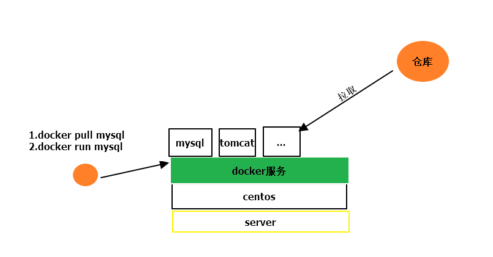


```
docker run hello-world
```

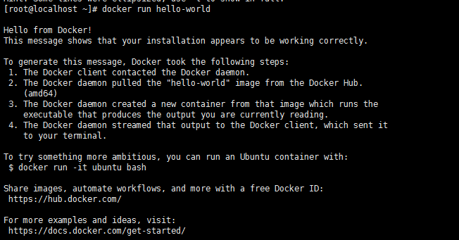


```
docker: Error response from daemon: OCI runtime create failed: container_linux.go:344: starting container process caused "process_linux.go:293: copying bootstrap data to pipe caused \"write init-p: broken pipe\"": unknown.
linux版本太低需要升级
```


参考文档

https://www.cnblogs.com/8000cabbage/p/7965489.html

# 升级linux内核方法

1)启用 elrepo仓库

 ```
rpm --import https://www.elrepo.org/RPM-GPG-KEY-elrepo.org
rpm -Uvh http://www.elrepo.org/elrepo-release-7.0-2.el7.elrepo.noarch.rpm
 ```

2)查看当前当前可以使用的linux内核

```
yum --disablerepo="*" --enablerepo="elrepo-kernel" list available
```

3)安装linux新的内核版本

```
yum --enablerepo=elrepo-kernel install kernel-ml
```

4)reboot

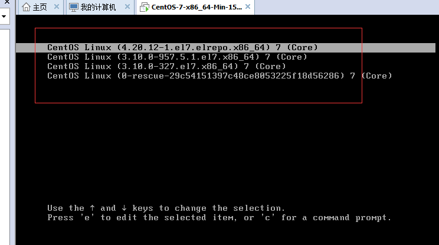

5)查看当前版本

```
uname -a
```

6)设置默认内核，启动项

```
nano /etc/default/grub
grub2-mkconfig -o /boot/grub2/grub.cfg
```

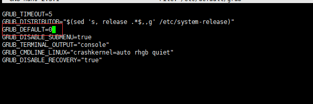


# docker 命令

## 镜像相关的命令

### 查看镜像

```
docker images
```

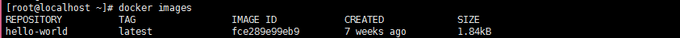

REPOSITORY:镜像的名称          

TAG：镜像的标签                 

IMAGE ID：镜像ID            

CREATED ：创建日期（不是获取该镜像的日期）            

SIZE：镜像大小

这些镜像都是存储在Docker宿主机的/var/lib/docker目录下。


### 搜索镜像

https://hub.docker.com/

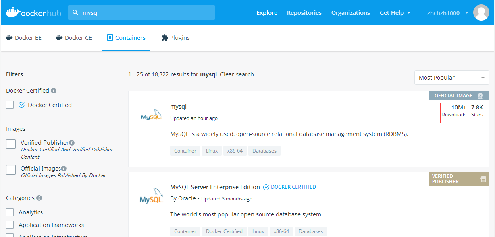


如果我们想通过命令的方式查询镜像，可以通过命令搜索

```
docker search 镜像名称（mysql）
```

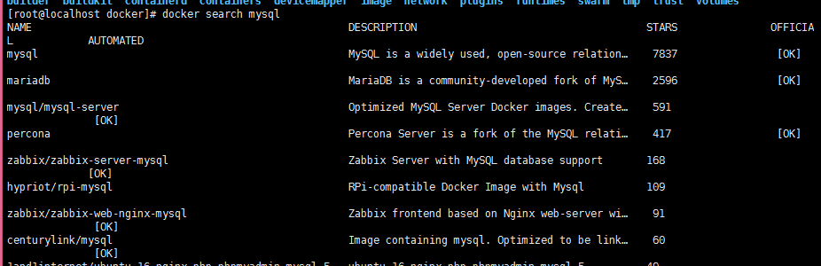

NAME:仓库名称                                                   

DESCRIPTION：镜像的描述                                     

STARS ：用户评价，反应一个镜像受欢迎的程序              

OFFICI：是否官方


### 拉取镜像

拉取镜像就是从中央仓库https://hub.docker.com 拉取镜像到本地

```
docker pull 镜像名称
```

例如我们想要myql

```
docker pull mysql
```

### 删除镜像

安装镜像ID删除镜像

```
docker rmi 镜像ID 
```

+ 前期是根据当前创建的容器要关闭

删除所有镜像

```
docker rmi `docker images -q`
```


# 容器相关的命令

## 创建容器和启动容器

创建容器命令：docker run

对应参数说明：

-i :表示运行容器

-t：表示容器启动后进入该容器执行命令，加入俩个参数后，容器创建就能登录进去，分配一个伪终端

-name:为创建的容器命名

-v:表示目录映射关系（前面是宿主机目录，后者是容器的目录）可以使用多个-v做多个目录或者文件的映射，注意：最好使用目录映射，在宿主机上修改文件，然后共享到容器中

-d :在run后面加-d参数，则会创建一个守护进程在后台运行（这样创建后就不会自动登录容器，如果只加-it就会在创建容器中进入容器）

-p ：表示端口映射，前者是宿主机端口，后者是容器的银蛇端口，可以使用多个-p做多个端口的映射


（1）交互式的创建容器

```
docker run -it(-i -t) --name=容器名称 镜像名称：标签 /bin/bash
```

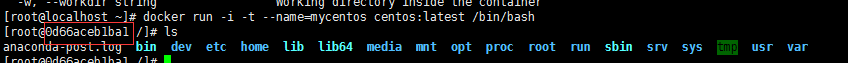


退出当前容器

```
exit
```


(2) 后台启动容器的进程

```
docker run -d --name=容器名称  镜像名称：标签
```

（3） 登录守护进程容器的方式

```
docker exec -it 容器名称(或者容器ID) /bin/bash
案例：docker exec -it mycentos2 /bin/bash
```

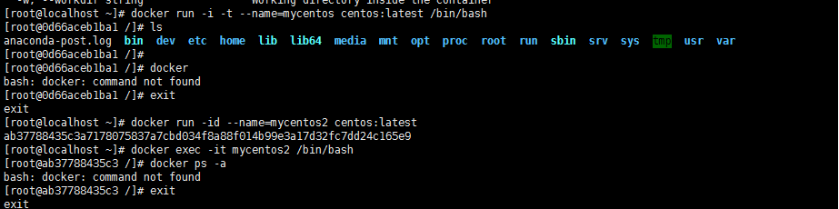


# 查看容器

查看正在运行的容器

```
docker ps
```

查看所有的容器

```
docker ps -a
```

查看最后一次运行的容器

```
docker ps -l
```

查看停止的容器

```
docker ps -f status=exited
```


# 停止与启动容器

停止容器:

 ```
docker stop 容器名称（或者容器ID）
 ```

启动容器：

```
docker start 容器名称（或者容器ID）
```


# 文件拷贝

如果我们需要将文件拷贝容器内可以使用cp命令

```
docker cp 需要拷贝的文件或者目录 容器名称:容器目录
```

也可以将文件从容器拷贝出来

```
docker cp 容器名称：容器目录 需要拷贝的文件或目录
```

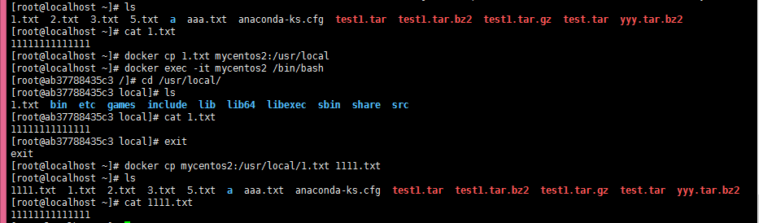


# 目录挂载

我们可以在创建容器的时候，将宿主机的目录与容器的目录进行映射，这样我们就可以通过修改宿主机某个目录的文件从而影响容器。

创建容器 添加-v参数 宿主机目录：容器目录

```
docker run -di -v /usr/local/myhtml:/usr/local/myhtml --name=mycentos3 centos
```

可以共享多个目录，可以出现权限不足。 selinux权限去掉，--privileged=true来解决目录没有权限的问题

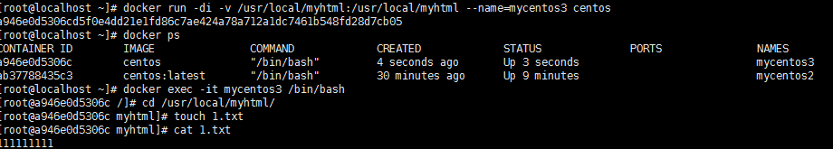


## 查看容器的ip

我们可以通过以下命令查看容器的运行各种参数

```
docker inspect 容器名称(容器ID)
```

也可以执行执行命令输出ip

```
docker inspect --format='{{.NetworkSettings.IPAddress}}' 容器名称（容器ID）
```

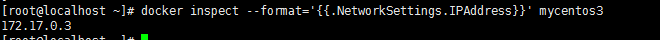

## 删除容器

```
docker rm 容器名称（容器ID）
```

注意：删除image 

docker rmi imageid  前期是根据这个image的容器要删除

docker rm 容器名称  删除容器 要先停止对应的容器


# 应用部署

## mysql 部署

1)拉取mysql镜像

```
docker pull centos/mysql-57-centos
```

2)创建容器

```
docker run -id --name=mysql -p 33306:3306 -e MYSQL_ROOT_PASSWORD=123456  centos/mysql-57-centos
```

-p 代表端口映射，宿主机端口：容器运行端口

-e 添加环境变量MYSQL_ROOT_PASSWORD 是root的登录密码

3）远程连接mysql

宿主机端口（192.168.154.201:33306） root 123456

## tomcat部署

1）拉取镜像

```
docker pull tomcat
```

2)创建容器

-p创建地址映射

````
docker run -id --name=mytomcat -p 9000:8080 -v /usr/local/webapps:/usr/local/tomcat/webapps tomcat
````

3)在/usr/local/webapps 创建1.html

```
hello world
```

4)访问

192.168.154.201:9000/1.html

## Nginx部署

1）拉取镜像

```
docker pull nginx
```

2)创建Nginx容器

```
docker run -id --name=myNginx -p 80:80 nginx
```


## redis部署

1)拉取镜像

```
docker pull redis
```

2)创建容器

```
docker run -id --name=myredis -p 6379:6379 redis
```


# 迁移和备份

## 容器保存为镜像

我们通过命令将容器保存为镜像

```
docker commit mycentos3 mycentos3_1
```

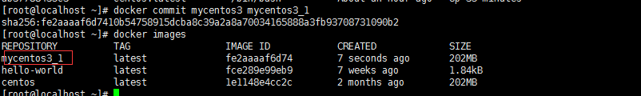

## 镜像备份

我们需要通过命令将镜像打成tar文件

```
docker save -o mycentos3.tar mycentos3_1
```


## 镜像的恢复与迁移

1）删除mycentos3_1对应的镜像，然后恢复

```
docker load -i mycentos3.tar
```

-i 输入文件

执行后再次查看，可以看到镜像已经恢复了


# DockerFile

## 什么是DockerFile

DockerFile是由一系列命令和参数构成的脚本，这些命令用于基础镜像并最终创建一个新的镜像

1、对于开发人员：可以为开发团队提供一个完全一致的开发环境

2、对于测试人员：可以直接拿开发时构建的镜像或者通过Dockerfile文件构建一个新的镜像开始工作

3、对于运维人员：在部署时，可以实现应用的无缝移植


## DockerFile常用的命令

| 命令                               | 作用                                                         |
| ---------------------------------- | ------------------------------------------------------------ |
| FROM image_name:tag                | 定义了使用哪个基础镜像启动构建流程                           |
| MAINTAINER user_name               | 声明镜像的创建者                                             |
| ENV key value                      | 设置环境变量(可以写多条)                                     |
| RUN command                        | 是DockerFIle的核心部分                                       |
| ADD source_dir/fire_dest_dir/file  | 将宿主机的文件复制到容器内，如果是一个压缩文件，将会复制后自动解压 |
| COPY source_dir/fire_dest_dir/file | 和ADD相似，如果有压缩不能解压                                |
| WORDIR path_dir                    | 设置工作目录                                                 |


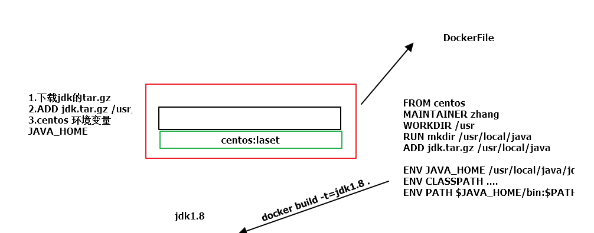


# 使用docker部署一个Golang

1）安装docker （已经安装）

2）mkdir myDocker 

3）cd myDocker && touch Dockerfile

4）Dockerfile写入脚本

```
FROM golang  # 母镜像
MAINTAINER zhang #开发作者
WORKDIR $GOPATH/src/godocker #工作目录
ADD . $GOPATH/src/godocker #将文件复制到镜像中
RUN go build main.go #执行操作（就跟在终端执行语句一样）
EXPOSE 8080  #暴露端口
ENTRYPONIT ["./main"] #程序入口
```

5）编写mian.go 放入到myDocker下

```go
package main

import (
   "net/http"
   "fmt"
)

func myHandler(w http.ResponseWriter,r *http.Request)  {
   fmt.Fprintln(w,"hello go")
}

func myHelloHandler(w http.ResponseWriter,r *http.Request)  {
   fmt.Fprintln(w,"hello")
}

func main()  {
   http.HandleFunc("/hello",myHelloHandler)
   http.HandleFunc("/go",myHandler)
   //net/http
   http.ListenAndServe(":8080",nil)
}
```

6）构建镜像

```
docker build -t zczdocker .
出现successfully build ...
说明构建成功
```

7）docker images 查看创建的镜像

8）docker run -p 8080:8080 -d zczdocker

9)本机上访问http://192.168.154.201:8080/hello 返回hello 

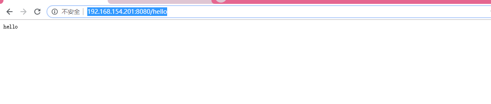

# 使用Dockerfile部署jdk

1)mkdir dockerjdk8

2）将jdk对应的jar包拷贝到dockerjdk8中

3）touch Dockerfile

4）nano Dockerfile

```
FROM centos
MAINTAINER zcz
WORKDIR /usr
RUN mkdir /usr/local/java
ADD jdk-8u144-linux-x64.tar.gz /usr/local/java/

ENV JAVA_HOME /usr/local/java/jdk1.8.0_144
ENV JRE_HOME $JAVA_HOME/jre
ENV PATH $JAVA_HOME/bin:$PATH

```

5)执行命令构建镜像

```
docker build -t='jdk1.8' .
```

注意jdk1.8后面的空格和点不能省略

6）查看镜像是否构建完成

```
docker images
```

7)运行镜像

```
docker run -it --name=myjdk1.8 jdk1.8
```

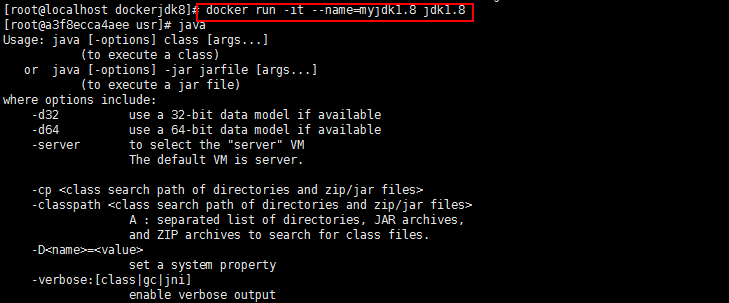


# SpringBoot整合docker的部署

1）创建springboot项目

```java
package com.example.demo;

import org.springframework.boot.SpringApplication;
import org.springframework.boot.autoconfigure.SpringBootApplication;
import org.springframework.web.bind.annotation.RequestMapping;
import org.springframework.web.bind.annotation.RestController;

@SpringBootApplication
@RestController
public class DemoApplication {

	@RequestMapping("/")
	public String home(){
		return "hello Docker world";
	}

	public static void main(String[] args) {
		SpringApplication.run(DemoApplication.class, args);
	}

}

```

2) 打成jar包

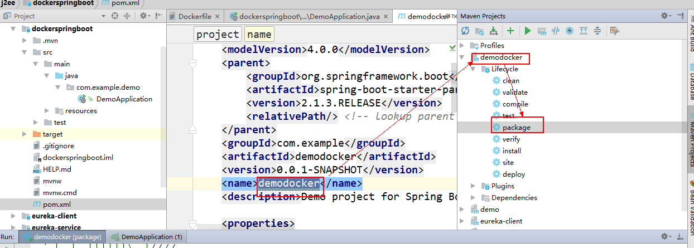

3）上传jar包到linux上面

4）创建文件夹dockerspringboot

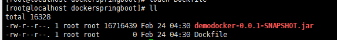

5）编写dockefile

```
FROM java
VOLUME /tmp
ADD demodocker-0.0.1-SNAPSHOT.jar app.jar
RUN sh -c 'touch /app.jar'
ENV JAVA_OPTS=""
ENTRYPOINT [ "sh","-c","java $JAVA_OPTS -Djava.security.egd=file:/dev/./urandom -jar /app.jar"]
```

+ $JAVA_OPTS -Djava.security.egd=file:/dev/./urandom为了缩短Tomcat启动时间添加一个系统属性指向"/dev/urandom"

6）执行编译

```
docker build -t dockerspringboot .
```

7)查看

```
docker images
```

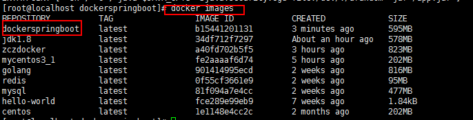

8)运行

```
docker run -d -p 8080:8080 dockerspringboot --name=myspringdocker
```


9) 访问用你docker所在ip

http://192.168.154.201:8082/

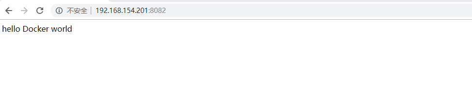

# 私库的搭建与配置


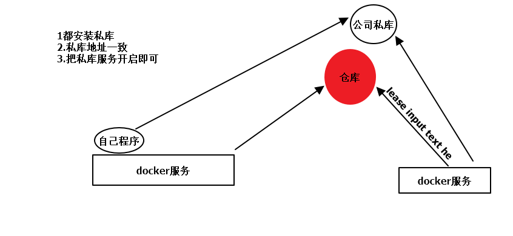

1）拉取私有仓库的镜像

```
docker pull registry
```

2)启动私有仓库容器

```
docker run -di --name=registry -p 5000:5000 registry
```

3)打开浏览器输入地址 

```
http://192.168.154.201:5000/v2/_catalog
```

看到私有库搭建成功并且内容为空

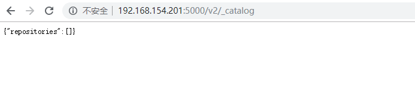

# 其他服务进行信任配置

1）修改daemon.json

nano /etc/docker/daemon.json

```
{"insecure-registries":["192.168.154.201:5000"]}
```

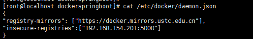

此步骤是让docker添加信任私有仓库

2）重启docker服务

```
systemctl restart docker
```

3)镜像上传到私有仓库

（1） 标记此镜像为私有仓库镜像

```
docker tag dockerspring 192.168.154.201:5000/dockerspring
```

(2) 在此启动私服容器

```
docker start registry
```

(3) 上传标记的镜像

```
docker push 192.168.154.201:5000/dockerspring
```

(4)查看

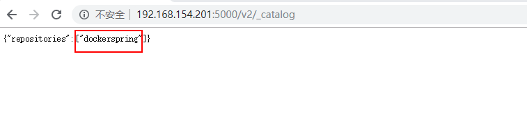

# 其他服务器下载

 ```
docker pull 192.168.154.201:5000/dockerspring
 ```


```
docker run -d -p 8083:8080 192.168.154.201:5000/dockerspring --name=myspringsifu
```

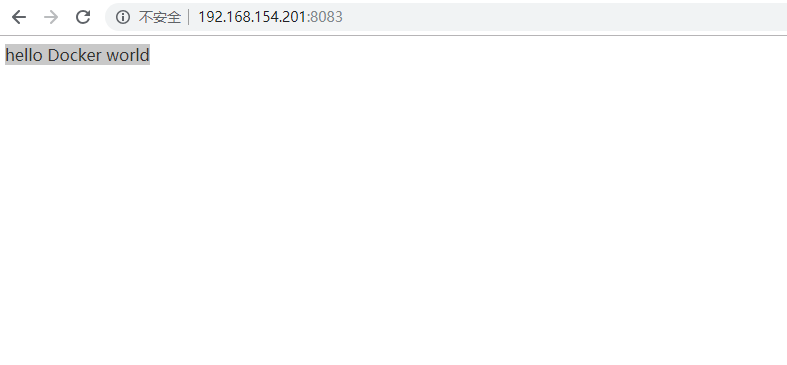

# Docker Compose

## Docker Compose 简介

Docker compose 是一种用于通过使用单个命令创建和启动Docker应用程序的工具。我们可以使用它来配置应用程序的服务。

它是开发，测试和升级环境的利器。

它提供以下命令来管理应用程序的整个生命周期：

+ 启动，停止和重建服务
+ 查看运行服务的状态
+ 流式运行服务的日志输出
+ 在服务上运行一次性命令

要是实现Docker compose，需要包括以下步骤：

+ 将应用程序环境变量放在Docker文件中公开访问。（docker-compose放在环境变量）

  ```
  echo $PATH
  ```

+ 在docker-compose.yml 文件中提供和配置服务名称，以便天它们可以在隔离环境中一起运行

+ 运行docker-compose将启动并运行整个应用程序

## Docker Compose 安装

```
curl -L https://github.com/docker/compose/releases/download/1.23.2/docker-compose-`uname -s`-`uname -m` -o /usr/local/bin/docker-compose
```

以下进取

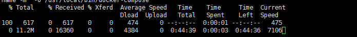


给docker-compose权限

```
chmod +x /usr/local/bin/docker-compose
```


## 第二种安装方式

1）下载[docker-compose-Linux-x86_64](https://github.com/docker/compose/releases/download/1.23.2/docker-compose-Linux-x86_64)

2）上传到linux中

3）echo $PATH

4）把下载文件放在/usr/local/bin

5）chmod +x /usr/local/bin/docker-compose

6）查看版本

```
docker-compose version
```

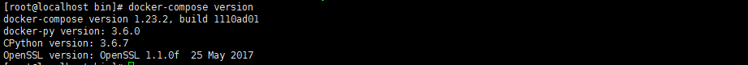


# Docker compose 实战

1)创建一个docker-compose.yml配置文件

```
version: '3'
services:
  mysql:
    restart: always
    image: mysql
    container_name: mysql
    ports:
      - 33306:3306
    environment:
      MYSQL_ROOT_PASSWORD: 123456
```

+ version 指定脚本语法解析器版本

+ services：要启动的服务列表

  +  mysql：服务器名称，可以随便起，不重复即可

    ​        + restart:启动方式，这里 always 表示总是启动，即使服务器重新启动了也会立即启动

  ​                  image ： 镜像的名称，默认从Docker hub下载

  ​                 container_name：容器名称，可以随便起，不要重复

  ​                 ports：映射端口

  ​                environment：环境变量

2) 运行

```
docker-compose up
```

-d 后台运行

3）docker ps 会看到进程


4）验证mysql开启

```
docker exec -it mysql mysql -uroot -p123456
```


# Docker Compose命令

前台运行

```
docker-compose up
```

后台运行

```
docker-compose up -d
```

启动

```
docker-compose start
```

停止

```
docker-compose stop
```

停止并移除容器

```
docker-compose down
```


